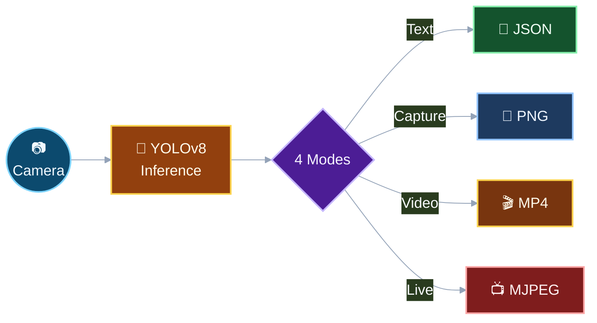
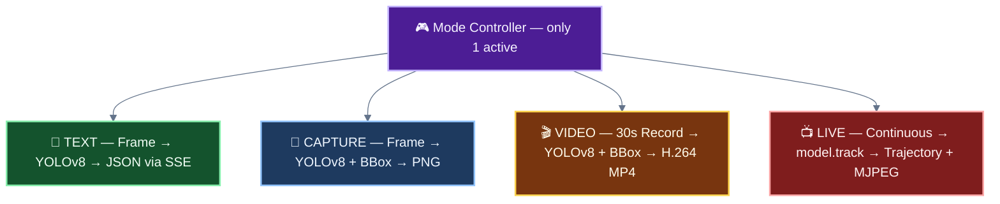
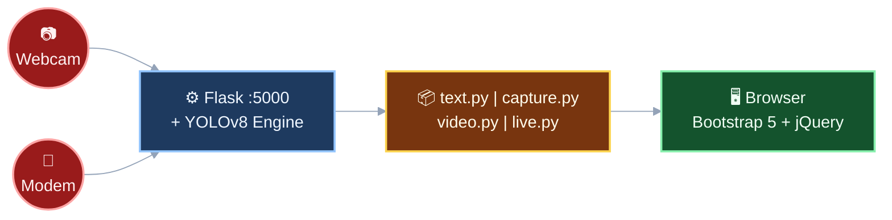
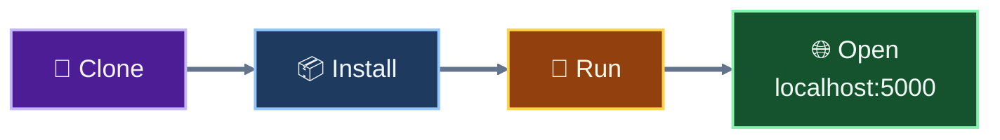
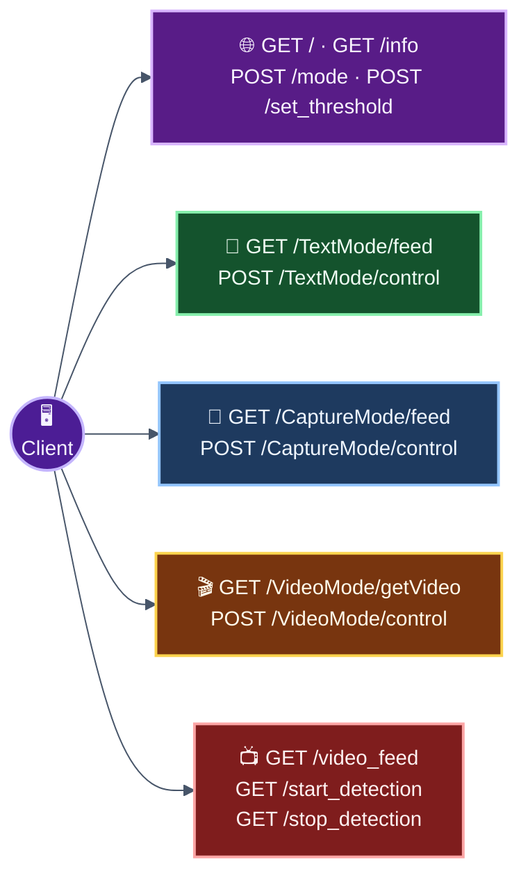

<div align="center">

# 🔥 Fire & Smoke Detection System

**Real-time AI-powered fire & smoke detection with 4 operating modes**

[](https://python.org)
[](https://flask.palletsprojects.com)
[](https://ultralytics.com)
[](https://opencv.org)

> 🎓 Capstone Project — Deep learning + Computer Vision + Flask Web App

</div>


## Hardware

```
 Jetson Nano B01, Pi Camera V3 
```

## How It Works



---

## The 4 Modes



<div align="center">

| | 📝 Text | 📸 Capture | 🎬 Video | 📺 Live |
|:--|:--:|:--:|:--:|:--:|
| **Toggle** | `Q` | `D` | `T` | Web UI |
| **Action** | `W` run/pause | `F` snap | `Y` record | Start/Stop btn |
| **Output** | JSON scores | PNG image | MP4 file | MJPEG stream |
| **Tracking** | — | — | — | ✅ |

</div>

---

## Architecture



---

## Project Structure

```
FINAL/
├── main.py                 # Flask entry point + all routes
├── MODES/
│   ├── text.py             # Mode 1 — Text SSE
│   ├── capture.py          # Mode 2 — Image capture
│   ├── video.py            # Mode 3 — Video recording
│   └── live.py             # Mode 4 — Live stream + tracking
├── sys_info.py             # Network diagnostics (serial AT cmds)
├── conv.py                 # YOLOv8 → TensorRT export
├── templates/index.html    # Web UI
├── yolov8n.pt              # Model weights (~6MB)
└── START.bat               # Windows venv launcher
```

---

## Quick Start



```bash
git clone https://github.com/HoangTran1106/cap_B.git
cd cap_B/FINAL

python -m venv venv && source venv/bin/activate   # Windows: venv\Scripts\activate

pip install flask flask-cors ultralytics opencv-python numpy imageio-ffmpeg pyserial keyboard

python main.py
```

Open **http://localhost:5000** — done!

---

## API Summary



---

## Config

```python
# main.py
model = YOLO('yolov8n.pt')        # swap for your custom model
conf_threshold = 0.25              # confidence threshold (0.0 – 1.0)
camera = cv2.VideoCapture(0)       # camera index

# MODES/video.py
vid_len = 30                       # recording duration (seconds)
frame_width, frame_height = 640, 480
fps = 30
```

---

<div align="center">

**Built by [Hoang Tran](https://github.com/HoangTran1106)** · 🎓 Capstone Project

⭐ Star this repo if you find it useful!

</div>